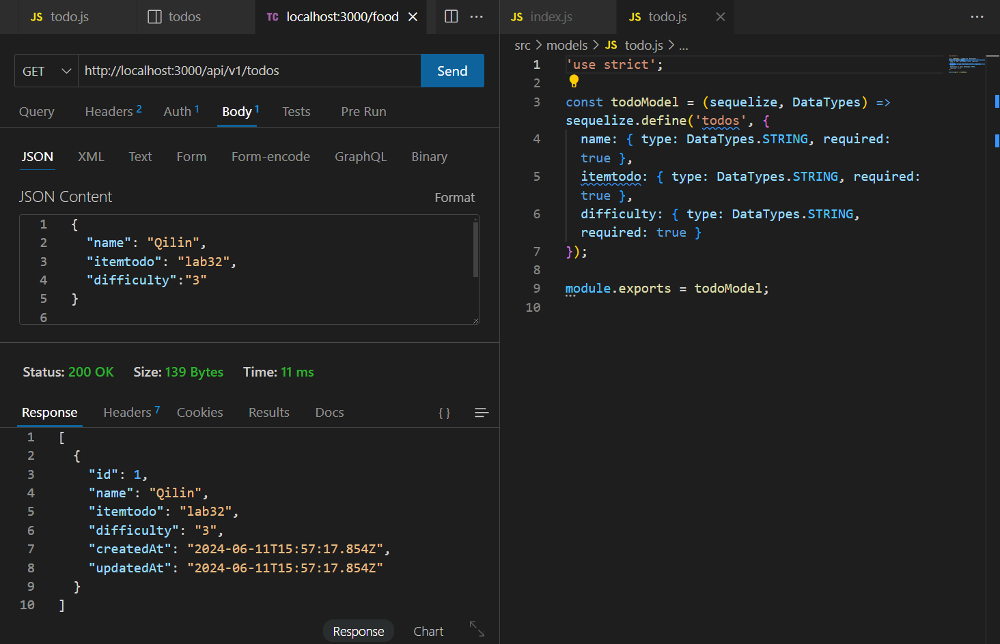
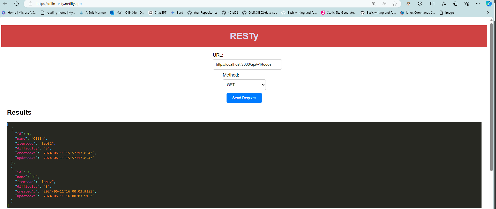
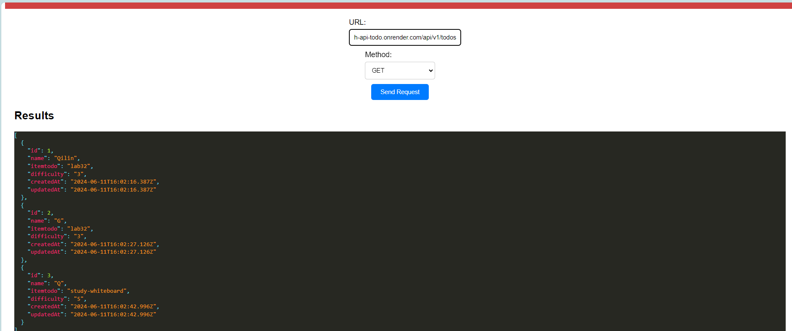
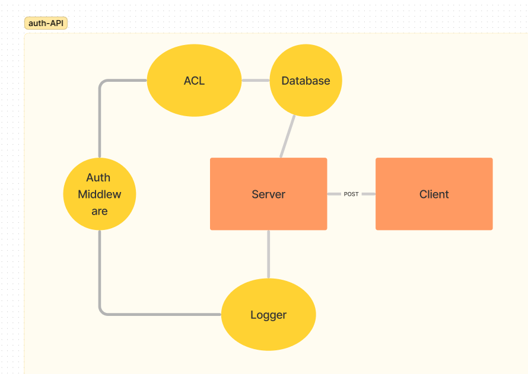
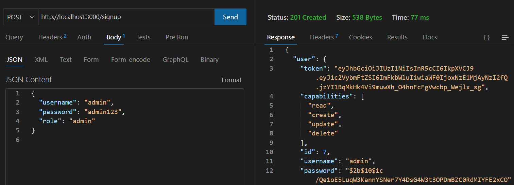
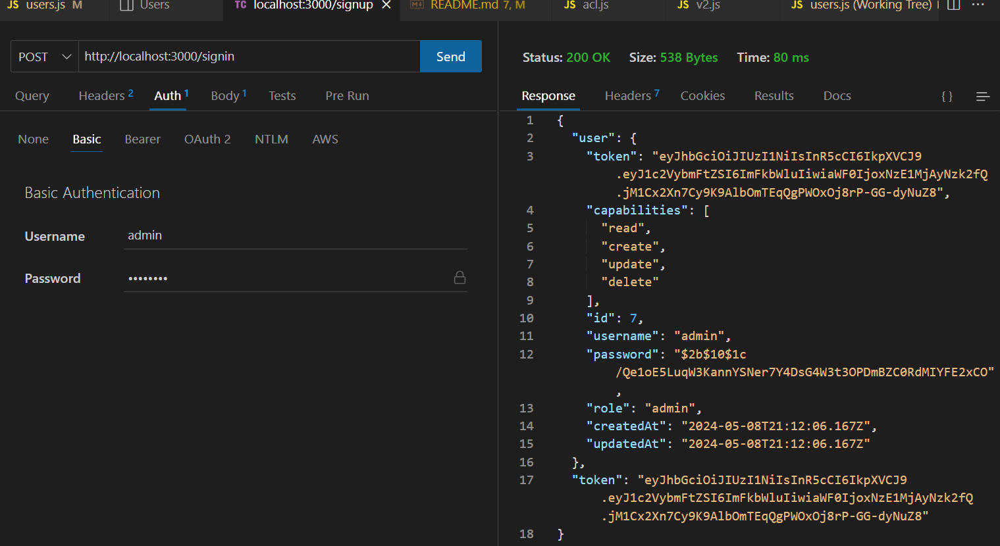
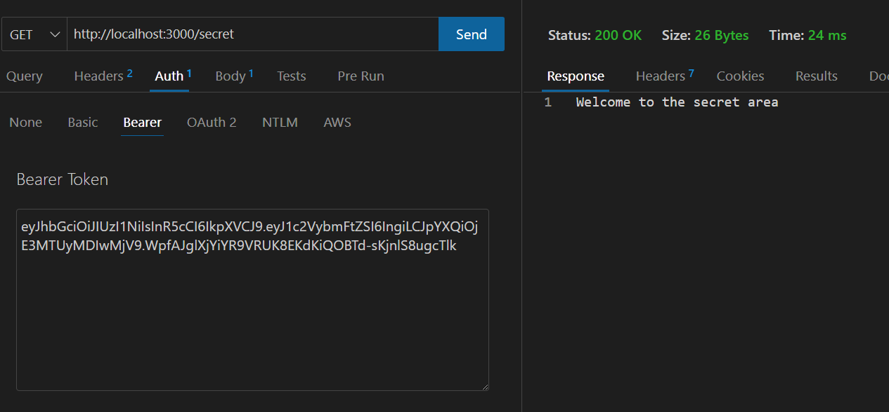
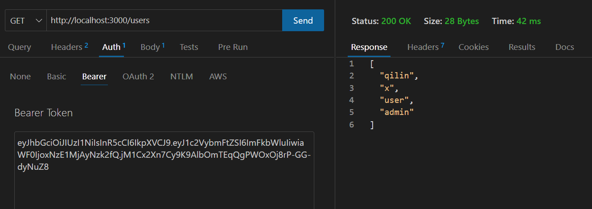

# auth-api

# Access Control (ACL) Overview

## Summary
Access Control (ACL) manages permissions within a system. While Authentication confirms a user's identity, Authorization determines their permissions. This ensures proper access to resources and actions on a server.

## Learning Objectives
### Students will be able to:
- **Describe and Define**:
  - Authorization
  - Roles
  - Capabilities
  - Access Control
- **Execute**:
  - Implement permissions-based access control middleware.
  - Integrate back-end authorization controls using Express and Postgres Database.
  - Use a virtual column for capabilities to create a roles system.

## Notes
### Access Controls
Access Controls restrict resources selectively. Common in systems like UNIX and websites, they limit actions based on user credentials. In RESTful APIs, it ensures users only perform authorized actions.

### Application Flow and Access Control
Different user types (admin, editor, guest, user) have varying access levels. Both backend and frontend must handle these constraints.

#### Back End (API Layer)
- Manage login cycles with the front-end.
- Maintain the User's database and roles.
- Authenticate users.
- Apply Role-Based Access Controls (RBAC).
- Restrict access using middleware and hooks.

#### Front End (Client Layer)
- Initiate and manage login processes.
- Store login tokens.
- Control access and behavior based on RBAC rules.

lab32 render site use with API: 
todo list 

Authentication Server Phase 3: Role Based Access Control

-[class 8 instructor README](https://github.com/codefellows/seattle-javascript-401d58/tree/main/class-08)

-[Github action link](https://github.com/QILINXIE02/auth-api/actions)

-[PR to main](https://github.com/QILINXIE02/auth-api/pull/2)

### UML diagram: 

POST/Signup:

POST/signin: 

GEt /secret should require a valid bearer token.:

Get /users  should require a valid token and “delete” permissions.: 

### ChatGPT helped implemented the test files 
