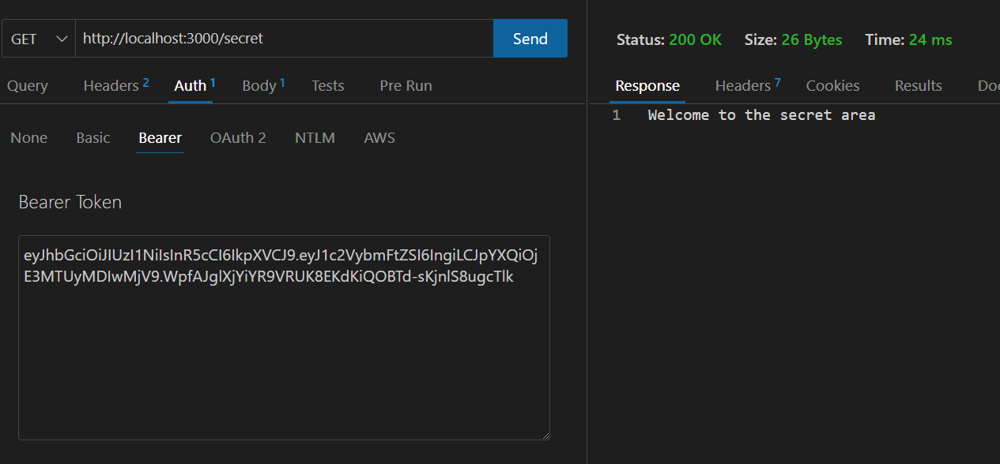

# auth-api
Authentication Server Phase 3: Role Based Access Control

-[class 8 instructor README](https://github.com/codefellows/seattle-javascript-401d58/tree/main/class-08)

-[Github action link](https://github.com/QILINXIE02/auth-api/actions)

-[PR to main](https://github.com/QILINXIE02/auth-api/pull/2)

### UML diagram: 

POST/Signup:

POST/signin: 

GEt /secret should require a valid bearer token.:

Get /users  should require a valid token and “delete” permissions.: 

### ChatGPT helped implemented the test files 